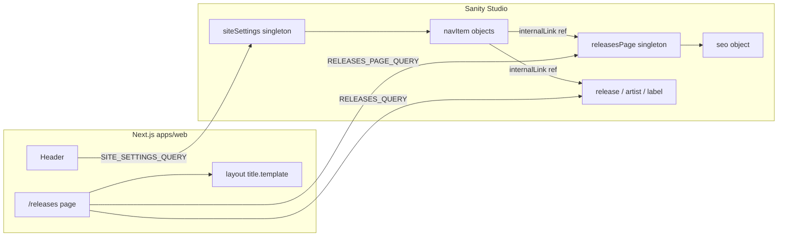

# SEO + releasesPage + navigation — implementation plan

Scope: **Phase 1 only** — enable `/releases` in header nav and CMS-managed SEO/intro for that route. Does **not** add generic `page` documents yet (planned Phase 2).

---

## Decisions (locked)

| # | Topic | Decision |
|---|--------|----------|
| 1 | Nav + SEO model | **A** — `releasesPage` singleton referenced from `navItem` (not route enum) |
| 2 | `ogImage` | Reuse **`imageWithAlt`** (alt + hotspot) |
| 3 | `/releases` copy | **Always** show static release count line; show CMS **`intro` in addition** when set |
| 4 | Title suffix | **`· Vinyl Market` only via root `layout.tsx` `title.template`** — `metaTitle` is always a short segment (e.g. `"Releases"`), never includes the suffix; no override field |
| 5 | Initial data | **Seed on first open** — document template / `initialValue` when singleton is opened, plus optional migration script for existing datasets |
| 6 | Nav vs H1 | **Independent** — `navItem.label` is nav-only; `releasesPage.title` is H1-only |
| 7 | Phase 1 boundary | Confirmed — no `page` type, no entity `seo`, no `homePage` in Phase 1 |
| 8 | Future `page` slugs | **Block reserved slugs** on `page` in Phase 2 (`releases`, `artists`, `labels`, app routes, etc.) |

---

## Architecture (Phase 1)



---

## 1. `seo` object (shared, embedded)

**File:** `apps/studio/schemaTypes/objects/seo.ts`

| Field | Type | Required | Notes |
|-------|------|----------|-------|
| `metaTitle` | `string` | no | Short title segment only → becomes `%s` in layout template → `"Releases · Vinyl Market"` |
| `metaDescription` | `text` | no | Max ~160 chars (validation warning) |
| `ogImage` | **`imageWithAlt`** | no | Social share image with required alt |
| `noIndex` | `boolean` | no | default `false` |

**Not in Phase 1:** `canonical`, `jsonLdType`, hreflang, full-title override.

```ts
export const seo = defineType({
  name: 'seo',
  title: 'SEO',
  type: 'object',
  fields: [
    defineField({
      name: 'metaTitle',
      title: 'Meta title',
      description:
        'Short page title for the browser tab and search results. Site name ("· Vinyl Market") is added automatically — do not include it here.',
      type: 'string',
    }),
    defineField({
      name: 'metaDescription',
      title: 'Meta description',
      type: 'text',
      rows: 3,
      validation: (Rule) =>
        Rule.max(160).warning('Keep under ~160 characters for search snippets'),
    }),
    defineField({
      name: 'ogImage',
      title: 'Social share image',
      type: 'imageWithAlt',
    }),
    defineField({
      name: 'noIndex',
      title: 'Hide from search engines',
      type: 'boolean',
      initialValue: false,
    }),
  ],
})
```

Register in `schemaTypes/index.ts` before document types that embed it.

---

## 2. `releasesPage` singleton

**File:** `apps/studio/schemaTypes/releasesPage.ts`

**Document ID:** `releasesPage` (`RELEASES_PAGE_ID = 'releasesPage'`)

**Fixed URL:** `/releases` — no `slug` field.

| Field | Type | Required | Notes |
|-------|------|----------|-------|
| `title` | `string` | yes | **H1 only** (not nav); default `"Releases"` |
| `intro` | `text` | no | Optional copy **below H1, above count** — never replaces count |
| `seo` | `seo` | no | Drives `generateMetadata` |

```ts
export const RELEASES_PAGE_ID = 'releasesPage'

export const releasesPage = defineType({
  name: 'releasesPage',
  title: 'Releases page',
  type: 'document',
  fields: [
    defineField({
      name: 'title',
      title: 'Page title',
      description: 'Heading (H1) on /releases. Navigation labels are set separately in Site settings.',
      type: 'string',
      validation: (Rule) => Rule.required(),
      initialValue: 'Releases',
    }),
    defineField({
      name: 'intro',
      title: 'Introduction',
      description:
        'Optional text shown under the page title. The release count line is always shown below this.',
      type: 'text',
      rows: 2,
    }),
    defineField({
      name: 'seo',
      title: 'SEO',
      type: 'seo',
    }),
  ],
  preview: {
    prepare: () => ({title: 'Releases page', subtitle: '/releases'}),
  },
})
```

**Studio structure** (`apps/studio/structure.ts`):

- Add `releasesPage` to `SINGLETON_TYPES`
- List item after Site settings (same pattern as `siteSettings`)

### Seed / first open

Ensure the singleton exists with sensible defaults without manual Studio steps:

1. **Structure + `documentId`** — opening "Releases page" in the desk always targets `_id: "releasesPage"`.
2. **Initial values** — use Sanity `initialValue` on the document type (or template in structure) so first save creates:
   - `title`: `"Releases"`
   - `seo`: `{}` (optional)
3. **Optional migration script** (`apps/studio/scripts/seed-releases-page.ts` or `sanity migration`) — idempotent `createIfNotExists` for datasets that already have Studio open before this ships.

**Phase 1 deliverable:** at minimum desk `initialValue`; add script if repo already has a deployed dataset.

---

## 3. Updated `navItem`

**Change:** Extend `LINKABLE_TYPES` only — keep `linkType: 'internal' | 'external'`.

```ts
const LINKABLE_TYPES = [
  {type: 'release'},
  {type: 'artist'},
  {type: 'label'},
  {type: 'releasesPage'},
]
```

```ts
{
  title: 'Internal (releases page, release, artist, or label)',
  value: 'internal',
},
```

**Nav label vs page title:** `label` on `navItem` is required and used only in the header. `releasesPage.title` is never read for nav. Example: nav `"Catalogue"` → `/releases`, H1 still `"Releases"`.

**Preview** — when `internalType === 'releasesPage'`, subtitle: `releases page: {title}`.

No new `linkType` in Phase 1.

---

## 4. GROQ queries

### `RELEASES_PAGE_QUERY` (new)

**File:** `apps/web/sanity/queries.ts`

```groq
*[_id == "releasesPage"][0]{
  title,
  intro,
  seo{
    metaTitle,
    metaDescription,
    noIndex,
    ogImage{
      asset,
      hotspot,
      crop,
      alt
    }
  }
}
```

Resolve OG URL in `toNextMetadata` via existing image URL helper (same as `CoverImage` / sanity image builder).

### `SITE_SETTINGS_QUERY`

Unchanged projection — Header special-cases `releasesPage` when `slug` is null:

```groq
"internal": internalLink->{
  _type,
  "slug": slug.current
}
```

---

## 5. `Header` resolution

**File:** `apps/web/components/Header.tsx`

```ts
const INTERNAL_PATH_BY_TYPE = {
  release: '/releases',
  artist: '/artists',
  label: '/labels',
} as const

// resolveNavLink:
// - external → externalUrl
// - internal + _type === 'releasesPage' → href '/releases' (ignore slug)
// - internal + slug → `/${base}/${slug}` for release | artist | label
// - uses navItem.label only (never releasesPage.title)
```

---

## 6. `toNextMetadata` helper

**File:** `apps/web/lib/seo.ts`

**Title rule:** Return `{ title: shortTitle }` only — **never** append `· Vinyl Market`. Root layout (`apps/web/app/layout.tsx`) already has:

```ts
title: {
  default: 'Vinyl Market',
  template: '%s · Vinyl Market',
},
```

`metaTitle` from CMS maps to `title` in metadata; fallbacks use page H1 or route default.

```ts
export function toNextMetadata(
  seo: SeoFields,
  fallbacks: {title: string; description?: string},
): Metadata {
  const title = seo?.metaTitle?.trim() || fallbacks.title
  // title is short segment only — template adds "· Vinyl Market"
  const description = seo?.metaDescription?.trim() || fallbacks.description
  // ogImage: build URL from imageWithAlt asset + dimensions helper
  return {
    title,
    ...(description ? {description} : {}),
    ...(seo?.noIndex ? {robots: {index: false, follow: true}} : {}),
    ...(ogImageUrl ? {openGraph: {images: [{url: ogImageUrl, alt: seo.ogImage.alt}]}} : {}),
  }
}
```

Apply the same helper on all future routes — **no per-route suffix logic**.

---

## 7. `/releases` route wiring

**File:** `apps/web/app/releases/page.tsx`

### Metadata

- Remove static `export const metadata`
- `generateMetadata` → `RELEASES_PAGE_QUERY` + `toNextMetadata(seo, { title: page.title ?? 'Releases', description: '...' })`

### Page UI (copy layout)

```
[H1]  releasesPage.title ?? "Releases"
[optional]  releasesPage.intro  — only if intro is non-empty
[always]    "{n} release(s) in the catalogue."  — computed from RELEASES_QUERY length
[grid]      release cards
```

Intro does **not** replace the count line.

### Fallbacks when singleton missing

| Field | Fallback |
|-------|----------|
| H1 `title` | `"Releases"` |
| `intro` | hidden |
| count line | always computed |
| metadata `title` segment | `"Releases"` |
| metadata `description` | `"Every release in the Vinyl Market catalogue."` |

---

## 8. TypeGen & build order

1. Schema in `apps/studio`
2. `yarn typegen`
3. Web: queries, `lib/seo.ts`, Header, `/releases`
4. Studio: open Releases page once (seed) → Site settings → add nav item (internal → Releases page, custom label)

---

## Phase 2 (out of scope — aligned to decisions)

| Piece | Action |
|-------|--------|
| `page` document | `title`, `slug`, `body`, `seo` |
| **Reserved slugs** | Validate `slug.current` against blocklist: `releases`, `artists`, `labels`, `api`, `_next`, etc. — reject at schema validation |
| `navItem` | Add `{type: 'page'}` → `/${slug}` |
| Route | `app/[slug]/page.tsx` (or segment that avoids conflicting with `app/releases/`) |
| Entity SEO | Optional `seo` on `release`, `artist`, `label` |
| Home | `homePage` singleton when needed |

**Reserved slug constant (Phase 2 sketch):**

```ts
export const RESERVED_PAGE_SLUGS = [
  'releases',
  'artists',
  'labels',
  'api',
] as const
```

Reuse `seo`, `toNextMetadata`, and layout title template for every route.

---

## Phase 1 checklist (implementation)

- [x] `seo` object + `imageWithAlt` ogImage
- [x] `releasesPage` singleton + structure + seed/initialValue
- [x] `navItem` → reference `releasesPage`
- [x] `RELEASES_PAGE_QUERY` + Header resolver
- [x] `lib/seo.ts` (short titles, template-friendly)
- [x] `/releases` — metadata, H1, optional intro, always count
- [x] `yarn typegen`
