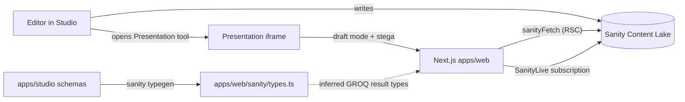

# Vinyl Market

A small monorepo containing a **Sanity Studio** (content editing) and a **Next.js 16** frontend (public site). Editors manage artists, labels, releases, and the site header navigation in the Studio; the Next app reads everything through Sanity's Live Content API with type-safe GROQ queries.

## Architecture



- **apps/studio** owns schemas (`artist`, `label`, `release`, `siteSettings`, `navItem`, `imageWithAlt`) and runs Sanity TypeGen.
- **apps/web** is a Next.js 16 App Router app. All data fetching happens in Server Components via `sanityFetch` from `next-sanity/live`.
- TypeGen reads the schema from `apps/studio` and writes inferred query result types directly into `apps/web/sanity/types.ts`. The Next app imports them with regular ESM imports.

## Repo layout

```
.
├── apps/
│   ├── studio/                       # Sanity Studio
│   │   ├── schemaTypes/              # documents + objects
│   │   ├── structure.ts              # singleton + custom desk structure
│   │   ├── sanity.config.ts          # Presentation, structure, schema, singleton actions
│   │   ├── sanity.cli.ts             # TypeGen config (writes into apps/web)
│   │   └── sanity.project.ts         # env helpers
│   └── web/                          # Next.js 16 (App Router, RSC)
│       ├── app/
│       │   ├── layout.tsx            # mounts <Header /> + <SanityLive />
│       │   ├── page.tsx              # home
│       │   ├── releases/             # /releases and /releases/[slug]
│       │   ├── artists/[slug]/       # artist detail
│       │   ├── labels/[slug]/        # label detail
│       │   └── api/draft-mode/       # Presentation / Visual Editing hooks
│       ├── components/               # Header, ReleaseCard, CoverImage, Tracklist, …
│       ├── components/ui/            # shadcn/ui primitives
│       ├── sanity/                   # client, live, image, queries, env, generated types
│       └── lib/                      # cn() + small formatters
├── turbo.json                        # dev / build / typegen / lint / typecheck pipelines
├── tsconfig.base.json                # shared compiler options
├── package.json                      # Yarn workspaces root
└── .env.example                      # single source of truth for env vars
```

## Stack

| Concern             | Choice |
|---------------------|--------|
| Package manager     | Yarn 1 workspaces (`apps/*`) |
| Task runner         | Turborepo |
| CMS                 | Sanity 5 + Presentation Tool |
| Frontend framework  | Next.js 16 (App Router, Server Components) |
| Styling             | Tailwind v4 + shadcn/ui (`new-york` style, neutral) |
| Data fetching       | `next-sanity` (`defineLive` → `sanityFetch` + `<SanityLive />`) |
| Type safety         | Sanity TypeGen with `defineQuery` |
| Images              | `@sanity/image-url` + `next/image` |

## Prerequisites

- **Node.js >= 20.11** (tested on 24.x)
- **Yarn 1** (`corepack enable` or `npm i -g yarn@1.22.22`)
- A Sanity account, project, and dataset (this repo defaults to project `1on695jt`, dataset `production`)
- For draft mode / Visual Editing: a **Sanity API token** with the `Viewer` role (create one at [sanity.io/manage](https://www.sanity.io/manage))

## Setup

```bash
# 1. install everything
yarn install

# 2. copy env templates
cp .env.example apps/studio/.env
cp .env.example apps/web/.env.local

# 3. generate Sanity types (only needed up front; the studio dev server
#    regenerates on schema changes automatically)
yarn typegen

# 4. start both apps in parallel (studio on :3333, web on :3000)
yarn dev
```

The Studio is at <http://localhost:3333>, the public site at <http://localhost:3000>.

## Scripts

### Root (delegated via Turbo)

| Command         | What it does                                              |
|-----------------|-----------------------------------------------------------|
| `yarn dev`      | Starts both apps in parallel (Studio + Next.js)           |
| `yarn build`    | Builds both apps (depends on `typegen`)                   |
| `yarn typegen`  | Extracts schema and generates GROQ query types            |
| `yarn lint`     | Lints both apps                                           |
| `yarn typecheck`| Typechecks both apps                                      |
| `yarn clean`    | Removes per-app build output and root `node_modules`      |

### `apps/studio`

| Command                 | What it does                                  |
|-------------------------|-----------------------------------------------|
| `yarn dev`              | Starts the Studio on port 3333                |
| `yarn build`            | Production build of the Studio                |
| `yarn typegen`          | `sanity schema extract --enforce-required-fields && sanity typegen generate` |
| `yarn deploy`           | Deploys the Studio to Sanity's hosting        |
| `yarn deploy-graphql`   | Deploys the GraphQL API (if you use it)       |

### `apps/web`

| Command         | What it does                                                  |
|-----------------|---------------------------------------------------------------|
| `yarn dev`      | Next.js dev server on port 3000                               |
| `yarn build`    | Production build                                              |
| `yarn start`    | Serves the production build                                   |
| `yarn typegen`  | Delegates to `apps/studio` (single source of truth)           |
| `yarn lint`     | ESLint (Next.js flat config)                                  |
| `yarn typecheck`| `tsc --noEmit`                                                |

## Content model

| Type             | Kind     | Notes                                                                                  |
|------------------|----------|----------------------------------------------------------------------------------------|
| `artist`         | document | Name, slug, cover, gallery, ordered alphabetically                                     |
| `label`          | document | Name, slug, cover, gallery                                                             |
| `release`        | document | Artist (ref), label (ref or "no label"), name, slug, format, speed, date, cover, gallery, multi-disc track listings |
| `siteSettings`   | document | **Singleton** with `title` + `navigation[]`. Enforced via `apps/studio/structure.ts` + `document.actions` / `newDocumentOptions` in `sanity.config.ts`. |
| `releasesPage`   | document | **Singleton** for `/releases`: `title` (H1), optional `intro`, `seo`. ID `releasesPage`. |
| `navItem`        | object   | `{label, linkType: 'internal' | 'external', internalLink?, externalUrl?}`. Internal refs: `releasesPage`, `release`, `artist`, or `label`. |
| `seo`            | object   | `metaTitle`, `metaDescription`, `ogImage` (`imageWithAlt`), `noIndex`. Embedded on `releasesPage` (and future types). |
| `imageWithAlt`   | object   | Image with required alt text and optional caption. Reused everywhere images appear.    |

## Routes

| Route                  | Type              | Source query              |
|------------------------|-------------------|---------------------------|
| `/`                    | Static (RSC)      | `HOME_RELEASES_QUERY`     |
| `/releases`            | Static (RSC)      | `RELEASES_QUERY` + `RELEASES_PAGE_QUERY` |
| `/releases/[slug]`     | SSG (`generateStaticParams`) | `RELEASE_QUERY`           |
| `/artists/[slug]`      | SSG (`generateStaticParams`) | `ARTIST_QUERY`            |
| `/labels/[slug]`       | SSG (`generateStaticParams`) | `LABEL_QUERY`             |
| `/api/draft-mode/enable` | Dynamic         | Sets Next draft-mode cookie via `defineEnableDraftMode` |
| `/api/draft-mode/disable` | Dynamic        | Clears draft-mode cookie  |

All page data is fetched in Server Components with the `sanityFetch` helper from `apps/web/sanity/live.ts`. It automatically switches to the `drafts` perspective + stega when Next.js draft mode is enabled.

## Header navigation

The header is a server component (`apps/web/components/Header.tsx`) that reads the singleton `siteSettings` document. Each `navItem` becomes a link:

- **Internal** → `releasesPage` → `/releases`; or `release` / `artist` / `label` + `slug` → detail URLs.
- **External** → uses `externalUrl` with `target="_blank"`.

Nav labels (`navItem.label`) are independent of page headings (e.g. `releasesPage.title`).

To edit navigation: Studio → **Site settings** → **Header navigation**.  
To edit the releases index copy/SEO: Studio → **Releases page** (or `yarn seed:releases-page` from `apps/studio` with `SANITY_API_WRITE_TOKEN` set).

## Visual Editing (Presentation Tool)

1. Set `SANITY_API_READ_TOKEN` in `apps/web/.env.local` (Viewer-role token from sanity.io/manage).
2. Run `yarn dev` so both apps are up.
3. Open the Studio at <http://localhost:3333>, click **Presentation** in the sidebar.
4. The Next.js site loads inside an iframe with draft mode on. Edits in the form panel propagate instantly thanks to `<SanityLive />`.
5. The floating **Exit preview** button (from `DisableDraftMode.tsx`) clears the cookie when you're done — Presentation itself has a built-in toolbar for the in-Studio flow.

The wiring lives in:
- `apps/studio/sanity.config.ts` → `presentationTool({previewUrl: {...}})`
- `apps/web/app/api/draft-mode/enable/route.ts` → `defineEnableDraftMode`
- `apps/web/app/layout.tsx` → mounts `<VisualEditing />` only when draft mode is on

## Type safety

Queries live in `apps/web/sanity/queries.ts` and are declared with `defineQuery` so Sanity TypeGen can infer their return types. After editing a query or a schema:

```bash
yarn typegen
```

This regenerates `apps/web/sanity/types.ts`. Since `overloadClientMethods` is on, `sanityFetch({query: SOME_QUERY})` returns a fully typed `data` field with no manual type assertions needed.

## Deployment notes

- **Sanity Studio** deploys via `yarn --cwd apps/studio deploy` (hosted at `<slug>.sanity.studio`).
- **Next.js app** is a standard Next 16 app — any platform that supports the App Router works. Add `NEXT_PUBLIC_SANITY_PROJECT_ID`, `NEXT_PUBLIC_SANITY_DATASET`, `NEXT_PUBLIC_SANITY_API_VERSION`, and `SANITY_API_READ_TOKEN` to your provider's env config.
- Add the production URL of the Next app to **CORS origins** in your Sanity project settings, with credentials enabled, so draft mode + Presentation work in production.

## Out of scope (today's first cut)

- Webhook-based path/tag revalidation (the Live Content API covers preview + dev fine; add a `/api/revalidate` route + GROQ webhook for production once content is real).
- Pagination, search, filters on `/releases`.
- Auth, cart, checkout.
- The `DISCOGS_API_TOKEN` env var is plumbed but no code reads it yet.

## Learn more

- [Sanity Live Content API](https://www.sanity.io/docs/content-lake/live-content-api)
- [Presentation Tool & Visual Editing](https://www.sanity.io/docs/presentation)
- [Sanity TypeGen](https://www.sanity.io/docs/sanity-typegen)
- [Next.js App Router](https://nextjs.org/docs/app)
